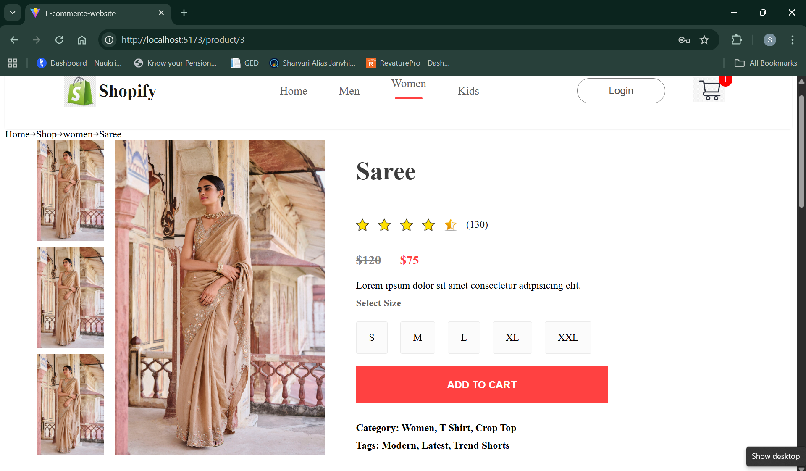
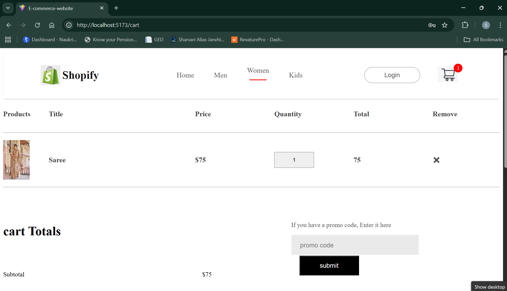
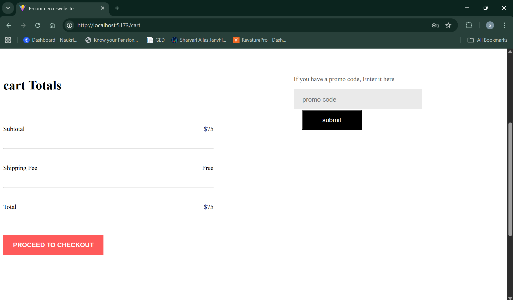
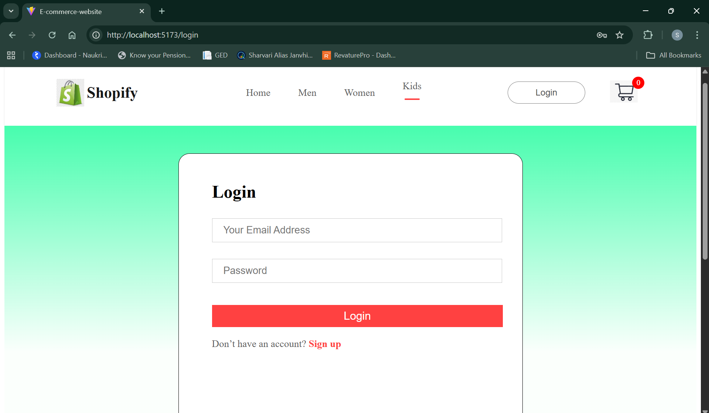
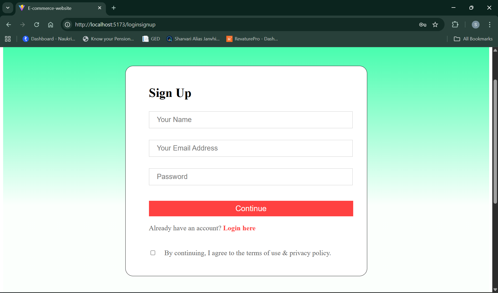
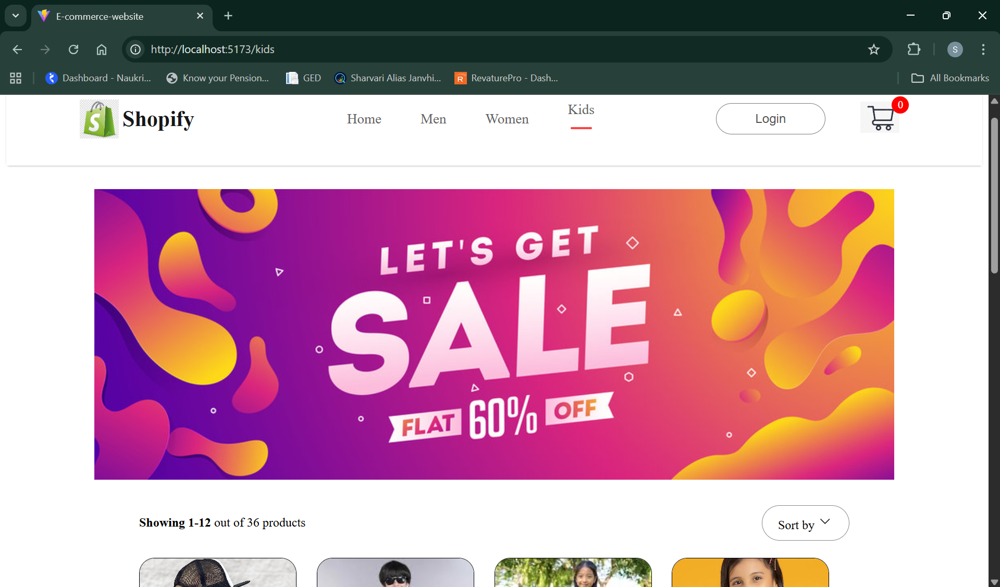

# 🛍️ E-Commerce Website (React + Vite)

A modern, responsive **E-Commerce Web Application** built with **React** and **Vite**, featuring category-based shopping, product details, cart functionality, and authentication pages.

---

## ✨ Features

* 🏠 Home page with hero section & latest collections
* 👕 Category pages – Men, Women, Kids
* 📦 Product listing & detailed product pages
* ⭐ Product ratings & reviews
* 🛒 Shopping cart

  * Add / remove products
  * Quantity update
  * Price & total calculation
* 🎟️ Promo code UI
* 🔐 Authentication pages

  * Login
  * Sign Up
* 📱 Fully responsive UI

---

## 🖼️ Screenshots

### 🏠 Home Page


---

### 👗 Product Details Page



---

### 🛒 Cart Page



---

### 💰 Cart Totals



---

### 🔐 Login Page



---

### 📝 Sign Up Page



---

### 🧒 Kids Category



---

## 🛠️ Tech Stack

* **Frontend:** React.js
* **Build Tool:** Vite
* **Routing:** React Router
* **State Management:** React Hooks / Context API
* **Styling:** CSS
* **Icons:** React Icons

---

## 📁 Project Structure

```
Ecommerce-Website/
│
├── public/
├── screenshots/
│
├── src/
│   ├── components/
│   ├── pages/
│   ├── context/
│   ├── data/
│   ├── App.jsx
│   └── main.jsx
│
├── package.json
└── README.md
```

---

## ⚙️ Installation & Setup

### 1️⃣ Clone the repository

```bash
git clone https://github.com/JSXHive/Ecommerce-Website.git
```

### 2️⃣ Navigate to the project

```bash
cd Ecommerce-Website
```

### 3️⃣ Install dependencies

```bash
npm install
```

### 4️⃣ Start development server

```bash
npm run dev
```

### 5️⃣ Open in browser

```
http://localhost:5173
```

---

## 🧪 Available Scripts

| Command           | Description              |
| ----------------- | ------------------------ |
| `npm run dev`     | Start development server |
| `npm run build`   | Create production build  |
| `npm run preview` | Preview production build |

---

## 🚀 Future Enhancements

* Backend integration (Node.js / Firebase)
* Payment gateway (Stripe / Razorpay)
* Wishlist functionality
* User order history
* Promo code logic
* Deployment (Vercel / Netlify)

---

## 🤝 Contributing

Contributions are welcome!

1. Fork the repository
2. Create a new branch

   ```bash
   git checkout -b feature-name
   ```
3. Commit your changes
4. Push to your branch
5. Open a Pull Request

---

## 📄 License

This project is licensed under the **MIT License**.

---

## 👨‍💻 Author

**JSXHive**
🔗 GitHub: [https://github.com/JSXHive](https://github.com/JSXHive)

---

